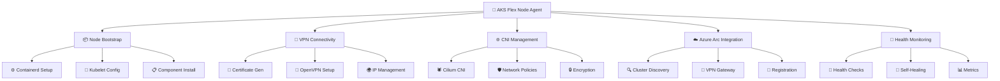
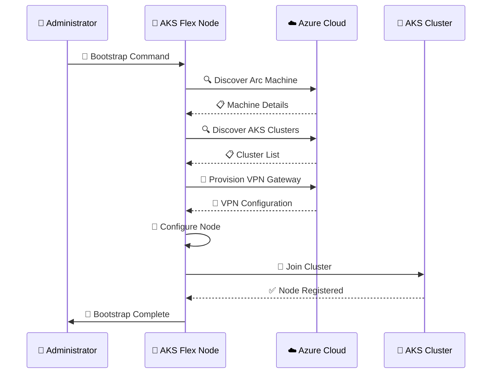
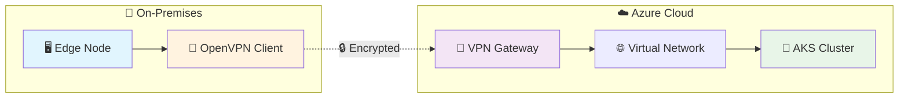
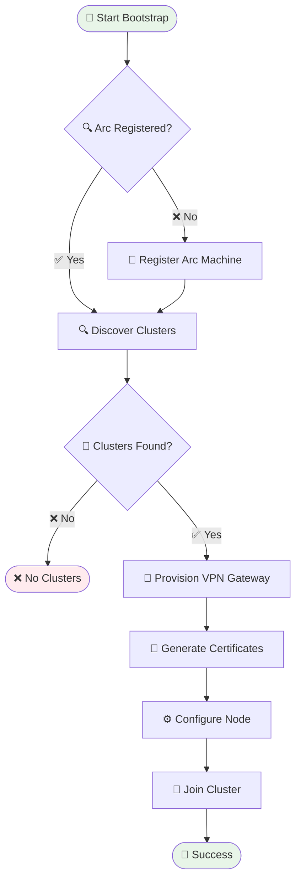
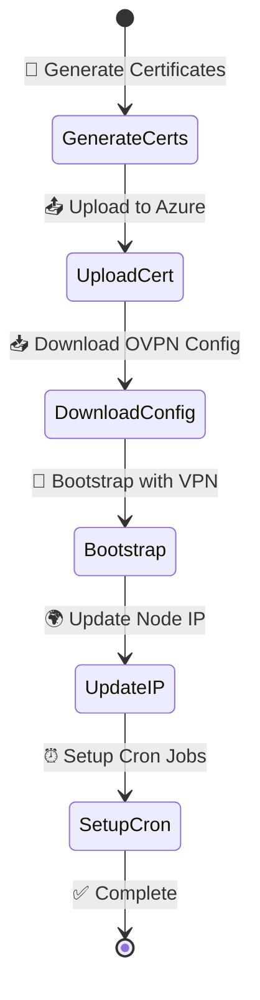
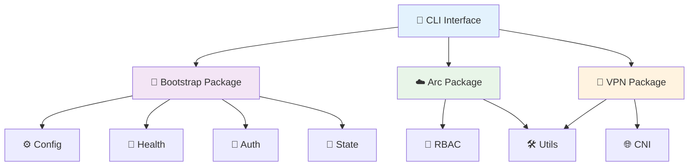

# 🚀 AKS Flex Node Agent

<div align="center">


**A comprehensive agent that automates AKS edge node deployment, configuration, and lifecycle operations with advanced networking and security features.**

</div>

## 📋 Table of Contents

- [🎯 Overview](#-overview)
- [🏗️ Architecture](#️-architecture)
- [✨ Key Features](#-key-features)
- [🔧 Installation](#-installation)
- [⚙️ Configuration](#️-configuration)
- [🚀 Usage](#-usage)
- [🔄 Workflows](#-workflows)
- [👥 Development](#-development)
- [📊 Monitoring & Troubleshooting](#-monitoring--troubleshooting)

## 🎯 Overview

The **AKS Flex Node Agent** is a next-generation Kubernetes edge node management solution designed for enterprise-grade AKS deployments. It provides seamless integration between edge nodes and Azure Kubernetes Service clusters with advanced networking, security, and automation capabilities.

### 🌟 Core Capabilities



## 🏗️ Architecture

### 📁 Project Structure

```
aks-flex-node/
├── 🎯 cmd/
│   └── aks-flex-node/           # 🚀 Main CLI entry point
├── 📦 pkg/
│   ├── bootstrap/               # 🔧 Node bootstrap functionality
│   ├── config/                  # ⚙️ Configuration management
│   ├── health/                  # 💚 Health checking and monitoring
│   ├── arc/                     # ☁️ Azure Arc integration
│   ├── vpn/                     # 🔐 VPN & IP management
│   ├── cni/                     # 🌐 CNI configuration
│   ├── auth/                    # 🔑 Authentication
│   ├── rbac/                    # 👥 RBAC management
│   ├── state/                   # 💾 State management
│   └── utils/                   # 🛠️ Utility functions
├── 🔧 configs/
│   ├── aks-flex-node.yaml       # 📋 Main configuration
│   └── systemd/                 # 🔄 Service files
├── 📦 debian/                   # 🐧 Debian packaging
├── 🚀 scripts/                  # 📜 Installation scripts
└── 📚 docs/                     # 📖 Documentation
```

### 🔄 System Flow



## ✨ Key Features

### 🚀 Core Functionality

| Feature | Description | Status |
|---------|-------------|---------|
| 🤖 **Auto Bootstrap** | Complete node setup with all components | ✅ Ready |
| 🔍 **Arc Discovery** | Automatic cluster detection and provisioning | ✅ Ready |
| 🌐 **VNet Integration** | Dynamic VNet discovery and configuration | ✅ Ready |
| 💚 **Health Monitoring** | Continuous health checks with self-healing | ✅ Ready |
| ⚙️ **Config Management** | Declarative YAML configuration | ✅ Ready |

### 🌐 Advanced Networking



### 🛡️ Security & Authentication

- 🔑 **Certificate Management**: Automated VPN certificate generation
- 🔐 **Secure Authentication**: Token-based Arc authentication
- 🛡️ **Network Security**: Advanced CNI policies and encryption
- 👥 **RBAC Integration**: Kubernetes role-based access control

## 🔧 Installation

### 📦 Via APT (Recommended)

```bash
# Update package index
sudo apt update

# Install AKS Flex Node Agent
sudo apt install aks-flex-node

# Enable and start service
sudo systemctl enable aks-flex-node
sudo systemctl start aks-flex-node
```

### 🛠️ Manual Installation

```bash
# Clone and build
git clone <repository-url>
cd aks-flex-node
make build

# Install binary and config
sudo make install

# Start service
sudo systemctl start aks-flex-node
```

### 🐋 Container Deployment

```bash
# Run as container
docker run -d \
  --name aks-flex-node \
  --privileged \
  --network host \
  -v /etc/aks-flex-node:/etc/aks-flex-node:ro \
  aks-flex-node:latest
```

## ⚙️ Configuration

### 📋 Main Configuration (`/etc/aks-flex-node/aks-flex-node.yaml`)

```yaml
# 🎯 Cluster Configuration
cluster:
  resourceId: "/subscriptions/xxx/resourceGroups/xxx/providers/Microsoft.ContainerService/managedClusters/xxx"
  server: "https://xxx.hcp.region.azmk8s.io"
  caCert: "/etc/kubernetes/certs/ca.crt"
  clusterDNS: "10.0.0.10"
  clusterDomain: "cluster.local"

# ☁️ Azure Configuration
azure:
  subscriptionId: "xxx"
  resourceGroup: "xxx"
  tenantId: "xxx"
  location: "xxx"
  arc:
    enabled: true
    autoDiscovery: true
    resourceGroup: "rg-arc-machines"

# 🖥️ Node Configuration
node:
  name: ""  # Auto-detected from hostname
  labels:
    kubernetes.azure.com/mode: "user"
    kubernetes.azure.com/role: "agent"
  maxPods: 110
  kubelet:
    evictionHard:
      memory.available: "100Mi"
      nodefs.available: "10%"
    kubeReserved:
      cpu: "100m"
      memory: "1Gi"

# 🌐 CNI Configuration
cni:
  type: "cilium"
  version: "1.14.5"

# 📦 Container Runtime
containerd:
  version: "1.7.20"
  pauseImage: "mcr.microsoft.com/oss/kubernetes/pause:3.6"

# ⚙️ Agent Configuration
agent:
  logLevel: "info"
  logFile: "/var/log/aks-flex-node/agent.log"
  pidFile: "/var/run/aks-flex-node.pid"
  healthCheckInterval: "30s"
```

### 🔧 Feature Flags

```yaml
# 🎛️ Feature Configuration
features:
  autoBootstrap: true      # 🚀 Enable automatic bootstrap
  healthMonitoring: true   # 💚 Enable health monitoring
  autoRecovery: true       # 🔄 Enable self-healing
  azureArcIntegration: true # ☁️ Enable Arc integration
  certRotation: true       # 🔄 Enable certificate rotation
```

## 🚀 Usage

### 📋 Standard Operations

```bash
# 🔍 Check service status
sudo systemctl status aks-flex-node

# 📊 View logs
sudo journalctl -u aks-flex-node -f

# 🚀 Bootstrap node
sudo aks-flex-node bootstrap-node

# 🔄 Reset configuration
sudo aks-flex-node reset

# 💚 Check health
sudo aks-flex-node status

# ℹ️ Version information
sudo aks-flex-node version
```

### 🔐 VPN Operations

```bash
# 🔑 Generate VPN certificates
sudo aks-flex-node vpn generate-certs

# 🌉 Bootstrap with VPN
sudo aks-flex-node bootstrap-vpn --vpn-config /path/to/client.ovpn

# 🌍 Update node IP
sudo aks-flex-node update-node-ip --interface tun0
```

### ☁️ Azure Arc Operations

```bash
# 🔍 Discover clusters
sudo aks-flex-node arc discover

# 🤝 Auto-connect to cluster
sudo aks-flex-node arc discover --auto-connect

# 📋 Show Arc status
sudo aks-flex-node arc status
```

## 🔄 Workflows

### 🚀 Auto-Discovery Workflow



### 🔐 VPN Setup Flow



## 👥 Development

### 🛠️ Building & Testing

```bash
# 🏗️ Build the project
make build

# 🧪 Run tests
make test

# 📦 Create package
make package

# 🧹 Clean artifacts
make clean
```

### 🔧 Development Environment

```bash
# 🐳 Start development environment
docker-compose up -d

# 🔧 Install dependencies
go mod download

# 🚀 Run in development mode
go run ./cmd/aks-flex-node daemon --config configs/aks-flex-node.yaml
```

### 🏗️ Project Architecture



## 📊 Monitoring & Troubleshooting

### 📈 Metrics & Monitoring

```bash
# 📊 View health metrics
curl http://localhost:8080/metrics

# 💚 Check component health
sudo aks-flex-node status --json

# 📋 View detailed logs
sudo tail -f /var/log/aks-flex-node/agent.log
```

### 🔍 Common Issues & Solutions

| Issue | Symptoms | Solution |
|-------|----------|----------|
| 🚫 **Build Errors** | Compilation fails | Ensure Go 1.21+ installed |
| 🔑 **VPN Certificate** | Connection timeout | Verify certificate format |
| 🌐 **CNI Problems** | Network policies fail | Check Cilium installation |
| ☁️ **Arc Discovery** | No clusters found | Verify Arc registration |
| 🤝 **Node Registration** | Join cluster fails | Check token and connectivity |

### 🐛 Debug Mode

```bash
# 🔍 Run with debug logging
sudo aks-flex-node daemon --log-level debug

# 📊 Health check with details
sudo aks-flex-node status --verbose

# 🔍 Check configuration
sudo aks-flex-node config validate
```

### 📋 Log Locations

| Component | Location | Purpose |
|-----------|----------|---------|
| 🔄 **Systemd** | `journalctl -u aks-flex-node` | Service logs |
| 📝 **Agent Log** | `/var/log/aks-flex-node/agent.log` | Application logs |
| 🌐 **CNI Logs** | `/var/log/cni/` | Network logs |
| 🔐 **VPN Logs** | `/var/log/openvpn/` | VPN connection logs |

## 🛡️ Security Considerations

- 🔐 **Root Privileges**: Required for system configuration
- 🔑 **Certificate Storage**: Secure storage with proper permissions
- 🎫 **Token Management**: Azure Arc tokens handled securely
- 🌐 **Network Security**: CNI policies and encryption enabled

## 🤝 Contributing

We welcome contributions! Please see our [Contributing Guide](CONTRIBUTING.md).

1. 🍴 Fork the repository
2. 🌟 Create a feature branch
3. ✅ Add tests for new functionality
4. 📝 Submit a pull request

## 📄 License

This project is licensed under the MIT License - see the [LICENSE](LICENSE) file for details.

---

<div align="center">

**🚀 Built with ❤️ for the Kubernetes community**


</div>